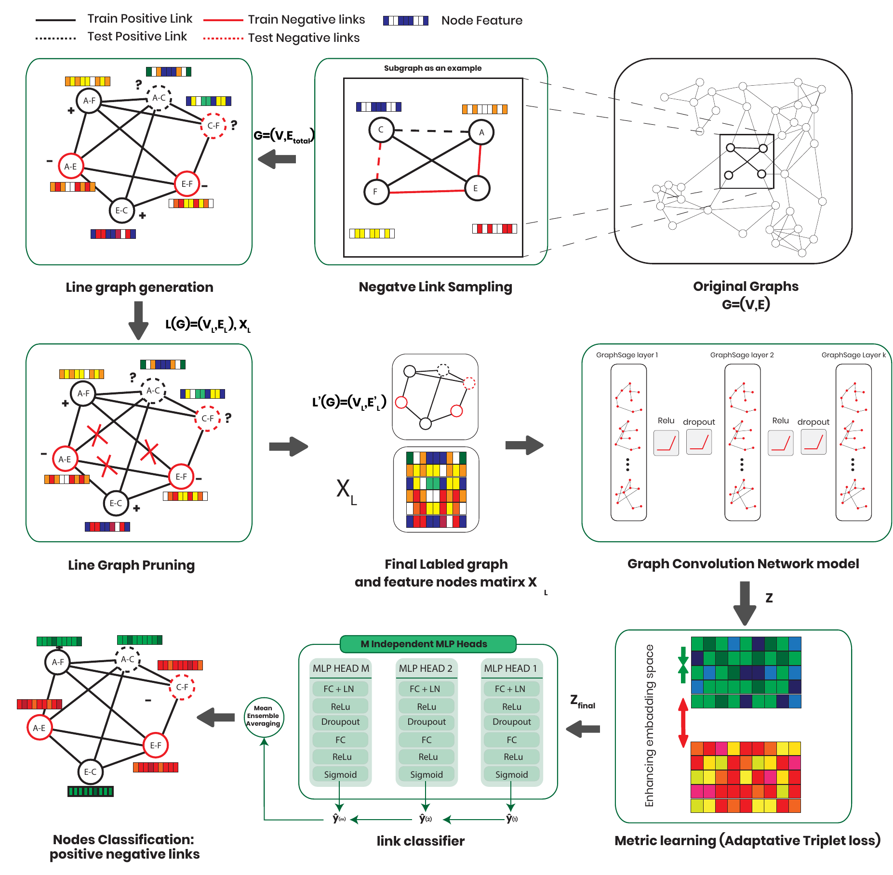

# A Line Graph-Based Metric Learning Framework for Robust Link Prediction in Complex Networks

**LineML** is a scalable framework that transforms the link prediction challenge into a node classification task on line graphs. It treats edges as first-class entities, enabling direct relationship modeling.



## Overview

Existing link prediction methods often suffer from two key limitations: they model edge relationships only indirectly through node-level comparisons, and they struggle with the severe class imbalance typical of real-world networks.

LineML addresses these challenges by reformulating link prediction as node classification on line graphs. This allows for direct modeling of edge-to-edge interactions. The framework integrates three complementary innovations:

1.  **GraphSAGE-Based Encoder**: Captures node attributes and topological context through multi-hop neighborhood aggregation.
2.  **Adaptive Metric Learning**: Uses degree-biased negative sampling and an adaptive triplet loss to refine embeddings based on example difficulty.
3.  **Scalable Pruning and Parallelization**: Mitigates the quadratic growth of line graphs (`O(m^2)`) using spectral pruning and supports distributed data-parallel (DDP) training for high-performance computing.

The framework has been evaluated on 18 benchmark datasets, achieving state-of-the-art performance, particularly on social and biological networks.

## Key Features

- **Direct Edge Modeling**: Transforms edges into nodes in a line graph to explicitly model relationships.
- **Robust to Imbalance**: Employes degree-biased usage of negative sampling to handle class imbalance effectively.
- **Scalable Architecture**: Includes spectral pruning to reduce graph size and supports multi-GPU training.
- **Metric Learning**: Refines embeddings to ensure better separation between positive and negative links.

## Project Structure

```bash
LineMLcode/
├── DataPropocessing/       # Data handling and processing modules
│   ├── linegraph_loader.py # Core logic for Line Graph construction
│   ├── dataloader.py       # PyG DataLoaders for mini-batch training
│   └── Graphpruner.py      # Pruning techniques (Spectral, KNN, etc.)
├── Models/                 # Model definitions
│   └── MLGNNmodel.py       # SophisticatedLinkPredictor architecture
├── utils/                  # Utility scripts
│   └── training.py         # UnifiedTrainer class for training loops
├── run_unified_training.py # Main entry point for training
└── requirements.txt        # Python dependencies
```

## Installation

1.  Clone the repository:
    ```bash
    git clone https://github.com/hosniadilemp-a11y/LineML_framework.git
    cd LineML_framework
    ```

2.  Install dependencies:
    ```bash
    pip install -r requirements.txt
    ```

## Usage

The main training script `run_unified_training.py` supports both single-GPU (simple) and multi-GPU (parallel) execution.

### 1. Simple Mode (Single GPU)
Run the training on a specific GPU (default is GPU 0):

```bash
python run_unified_training.py --mode simple --gpu 0
```

### 2. Parallel Mode (Distributed Data Parallel)
Run distributed training across all available GPUs:

```bash
python run_unified_training.py --mode parallel
```

### Arguments

| Argument | Default | Description |
| :--- | :--- | :--- |
| `--mode` | `simple` | Training mode: `simple` or `parallel` |
| `--gpu` | `0` | GPU ID to use in simple mode |
| `--epochs` | `200` | Number of training epochs |
| `--batch_size` | `512` | Batch size for training |
| `--lr` | `0.0001` | Learning rate |
| `--verbose` | `False` | Enable verbose logging |

## Configuration

You can customize the training configuration in `run_unified_training.py` by modifying the `config` dictionary:

```python
config = {
    'features': 'random',         
    'pruning': {'method': 'knn', 'k': 5}, # Pruning strategy
    'pos_neg_ratio': 2.0,         # Ratio of negative samples
    'sampling_strategy': 'degree' # Negative sampling strategy
}
```

## License

[MIT License](LICENSE)
